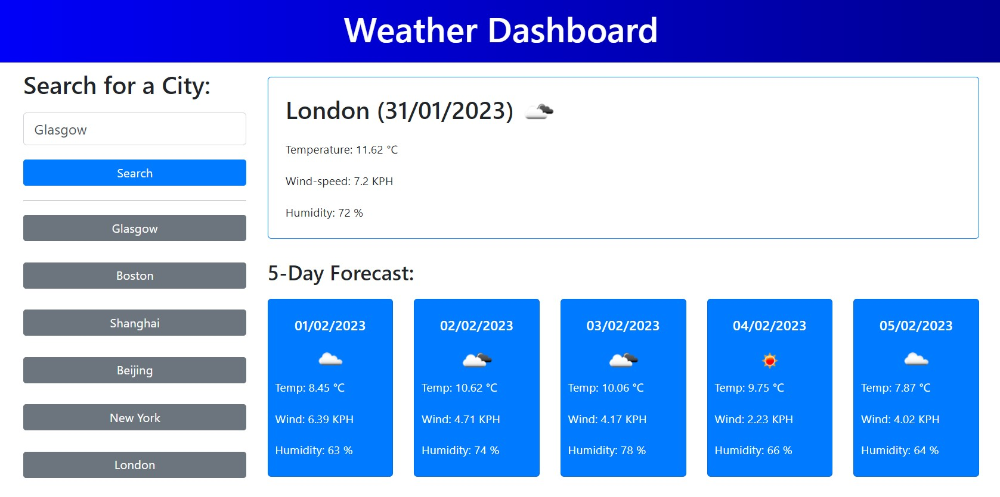

# weather-dashboard
Creating an app that allows users to see the weather forecast for cities of their choosing

## Discription

This weather dashboard app is created with form inputs and will run in the browser and feature dynamically updated HTML and CSS.

The application can:

- Display the current and future weather outlook when a user searches for a city 

- Add that city to the search history 
    
- When a user views the current weather conditions for that city they are presented with:

    - The city name
    - The date
    - An icon representation of weather conditions
    - The temperature
    - The wind speed
    - The humidity

- When a user views future weather conditions for that city they are presented with a 5-day forecast that displays:

    - The date
    - An icon representation of weather conditions
    - The temperature
    - The wind speed
    - The humidity
    
- When a user clicks on a city in the search history they are again presented with current and future conditions for that city

- Store any persistent data using localStorage 

## Installation
The app can be installed follwing the link to the application page:
https://dr-jingyuezhao.github.io/weather-dashboard/

## Usage 

When opening the app in the browser, the user will be presented with a weather dashboard. The search box is displayed on the left side of the dashboard. The current and future weather outlook is displayed on the right side of the dashboard. The current weather condition is displayed at the top, with the city name, date, a weather icon, and information on temperature, wind speed, and humidity. The 5-day weather forecast is displayed at the bottom of the dashboard, with the date, a weather icon, and information on temperature, wind speed, and humidity. Each searched city will be added to the search history and the weather data will be saved using localStorage. Clicking a city in the search history allows the user to retrieve the stored weather data.

**Website demo**

The following image shows the web application's appearance and functionality:

## Credits

Resources:
* https://openweathermap.org/forecast5
* https://openweathermap.org/forecast5#JSON
* https://openweathermap.org/weather-conditions
* https://openweathermap.org/forecast5#name5
* https://coding-boot-camp.github.io/full-stack/apis/how-to-use-api-keys
* https://momentjs.com/
* https://api.jquery.com/
* https://stackoverflow.com/questions/60024761/5-responsive-cards-per-row-with-bootstrap-4
* https://www.w3schools.com/css/css3_gradients.asp
* https://www.w3schools.com/jsref/jsref_substr.asp

## License

MIT License

Copyright (c) 2023 Jasmine

Permission is hereby granted, free of charge, to any person obtaining a copy
of this software and associated documentation files (the "Software"), to deal
in the Software without restriction, including without limitation the rights
to use, copy, modify, merge, publish, distribute, sublicense, and/or sell
copies of the Software, and to permit persons to whom the Software is
furnished to do so, subject to the following conditions:

The above copyright notice and this permission notice shall be included in all
copies or substantial portions of the Software.

THE SOFTWARE IS PROVIDED "AS IS", WITHOUT WARRANTY OF ANY KIND, EXPRESS OR
IMPLIED, INCLUDING BUT NOT LIMITED TO THE WARRANTIES OF MERCHANTABILITY,
FITNESS FOR A PARTICULAR PURPOSE AND NONINFRINGEMENT. IN NO EVENT SHALL THE
AUTHORS OR COPYRIGHT HOLDERS BE LIABLE FOR ANY CLAIM, DAMAGES OR OTHER
LIABILITY, WHETHER IN AN ACTION OF CONTRACT, TORT OR OTHERWISE, ARISING FROM,
OUT OF OR IN CONNECTION WITH THE SOFTWARE OR THE USE OR OTHER DEALINGS IN THE
SOFTWARE.